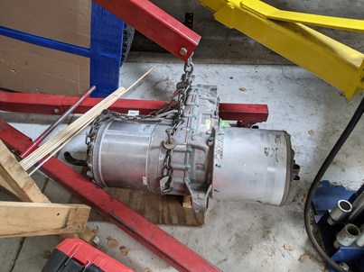

# EV Conversion

This repo contains notes, references and materials related to converting
Internal Combusion Engine (ICE) cars to Electric Vehicles (EV)

Over the years, I've done a few engine swap projects as a hobby.  An '89 Ford
Mustang 5.0 V8 into an '85 Toyota 4Runner, a '95 Chevy Camaro LT1 5.7 V8 into a
'74 Chevy K5 Blazer, and a '74 + '78 Datsun 260z + 280z.  These conversions
were all done in the erra before EV's hit mainstream.  I had contemplated an
alt-fuel conversion on the Blazer but opted for a more conventional ICE swap at
the time.  Now that high performance EV parts are becoming plentiful in
wrecking yards it's time to start embarking on more environmentally friendly
conversions for my collection of project cars.  My goal is to get my conversion
strategy "dialed in" with a first conversion, and replicate that across the
others.  Hopefully these notes will help others consdering similar projects.


# Current Status

As of Dec 2022:

* First vehicle to convert: '85 Toyota 4Runner (the 5.0 V8 was over the hill)
* All the major systems have been acquired (see below for details)
* Replacement Logic boards have been installed and powered on
* LDU is mounted where the transfercase used to be
* Battery boxes are fully fabricated
* BMS tested with full pack 
* HV wiring is completed
* Low voltage control circuits being built


# Major Systems

There are numerous options for each of the major systems, and sourcing parts
only from one manufacturer isn't necessarily the optimal path, depending on the
objectives of the project.  For my conversions, they aren't intended as daily
drivers, but more weekend/play cars, thus range can be a bit lower (I'll be
happy with ~100 miles.)

## Motor

Purchasing "new" high performance electrc motors is still very costly.  **Tesla
Large Drive Units** from S/X cars are plentiful at wrecking yards, and are
quite reasonably priced (~$2-3K) for what they are capable of.  Depending on the
battery pack, and current/voltage delivery, I anticipate over 400 hp and 400 ft
lb, which is a significant bump from the existing engines in my project cars.

My plan is to skip a transmission or transfer case, and instead install the
motor roughly where the t-case was before.  This should help reduce weight, and
leave more room in the engine compartment for batteries and other components.
To achieve proper gear ratios for drivability, this will involve swapping out
the stock gear set in LDU with an aftermarket [reduced ratio geat
set](https://zero-ev.co.uk/product/tesla-large-drive-unit-gear-set-4-51/) and a
[limited slipp differential](https://zero-ev.co.uk/product/quaife-large-tesla-drive-unit-limited-slip-diff-lsd/).
I may opt to change the gear ratios in the differentials to achieve > 70mph on
the highway without over-revving the motor, but given this is more intended for
around town and 4-wheeling, the higher ratio might be more desirable, so I'll
wait until it's on the road to decide.

To have complete control over the motor, I've opted for the
[OpenInverter](https://openinverter.org/wiki/Main_Page)
[Tesla LDU Drop-in Logic Board](https://openinverter.org/shop/index.php?route=product/product&product_id=64).
This will require more effort to get set up, but will provide the ultimate in
configurabliity, down to the level of modifying the code to tweak behavior to
suit my needs.  There are aftermarket companies that offer more "turn key"
solutions in this space, but I've opted for the open source path.

Misc Notes:
* Motor to the rear, axles in front of the unit, rotate away from the motor on top
* Toyota 4Runner shafts: top rotates towards driver
* Motor would have to be on the passenger side for normal rotation direction.
* Would cause alignment challenges for front shaft which is on the passenger side
* Plan to reverse direction (requires [pump reversal kit](https://zero-ev.co.uk/product/tesla-large-drive-unit-replacement-reverse-drive-oil-pump/))
* Controller Source: https://github.com/damienmaguire/Tesla-Drive-Unit

LDU part numbers:
* 2012-2016 1002633-00-F -- e.g. 2014 S 85
* 2016-2020 1037000-00-F
* ?? 1025276-00-Q

Shafts: 36mm?  26 spline? (need to measure...)

Porsche 930 stump
Cv joints:
28 spline
30.6mm shaft (some list as 30mm)
Cages are weak Link - 4130 cages are stronger
Axles: 300M
108mm outer cv - 40mm thick
Normal joint can do 22 degree, high angle versions up to 35 degrees
Boot must match shaft diameter


 

## Battery Pack

While running a full Tesla S/X battery pack would provide long range, and the
voltage/amperage needed for full performance out of the Tesla LDU, they are
still quite expensive as they're in very high demand.  Based on my research,
the Chevrolet Volt battery pack is quite popular as it's far less expensive
(~2K), can deliver the voltage and amerage for the LDU, will take up less
space, just with less overall range (16.5 kwh vs. the Tesla up to 100 kwh.)
The 1st generation is the best supported by my chosen BMS option (see below.)

My original plan was to see if I could squeeze the full pack in the engine
compartment and tranny tunnel, but it turned out to be a little too large and I
didn't want to resort to heavy modifications of the body sheet metal.  My new
plan is to split the pack into the 3 modules, and install the large module in
the engine compartment/tunnel, small module where the factory gas tank was, and
the medium module behind the rear axle (roughly where the factory spare tire
would have been.)  I plan to include the contactors and other high-voltage
junctions inside the front battery box, along with the factory "quick"
disconnect from the Volt pack.

Misc Notes:
* Generation 1: 2011-2015
* Purchased 2014 pack
* Lg chem (LiMn2O4)
* Roughly, 65" long, 37" wide, 15" tall in orginal pack
* Has primary+secondary bms setup which works with simpbms
* Apparently second generation (2016-2019) has single unit which isn't compatible, but might be able to swap over to the older secondaries
* Front unit has main contactors, pre-charge resistor, high voltage pack heater (in coolant connector)
* TODO - experiment with this inline heater to see if it's powerful enough to be a cabin heater
* 2011-2012: 16.0 kwh, 435 lbs, 288 cells, 360v, nom, 96S 3P, 390v @ 87%SOC (~full) -- cell: 3.7v nom, 4.15 max, 3.0 min
* 2013-2014: 16.5 kwh
* 2015: 17.1
* 2016(2nd gen): 18.4 kwh, 192 cells
* 2013 battery test by gov says:
* 96 cells in series
* Pack weight: 435 lb
* Nominal Cell/System Voltage: 3.7/355.2 V
* Min/Max Cell Voltage: 3.00/4.15 V call  -- 288-394v pack
* Capacity graph drops rapidly at ~330v (3.4375v/cell)
* Anecdotally GM considers full as ~4.0v or ~390v
* Max load - 350kw for ~10s

General Li-ion battery notes:
* Discharge range: -20c to 60c
* Charge range: 10c to 30c for optimal life (0-45c with shorter life)

Notes from forum posts on people reverse engineering the pack:
* Sensor is lem product dhab s44 a 0 to 600 amp inductive coupled DC. Runs on 5 v ref.

Battery interface module:
- The big ceramic white resistors are not heaters, they are precharge resistors. They are used together with a precharge relay (one of the small relays) and a MOSFET PWM, to ramp up the voltage before the main contactor turns on (so you don't get any sparking).
- One of the water connectors contains a HV heater (working from a pack voltage), again, controlled by one MOSFET
- All precharge, heater and contactors can be controlled externally, not using BMS module (it does not interface to it at all). Using X1 and X2 external connectors


## Battery Management System

Running a Lithium Ion battery without a BMS is a recipe for disaster as they
can cause fires if they overheat.  Various commercial options exist, but in
sticking with my general open source theme, I've opted for [Simp
BMS](https://www.secondlife-evbatteries.com/bms.html) which is designed to
leverage the OEM "secondary" units in the battery packs themselves.  It has
support for various types of batteries, including the Chevrolet Volt Gen 1 pack
I've selected.

Misc Notes:
* https://github.com/tomdebree/SimpBMS/raw/master/Simp%20BMS%20Setup%20Manual%20V0.22.pdf
* Simpbms looks like it has support for using original fuel gauge out of the box
* Loading new firmware: https://www.pjrc.com/teensy/loader_linux.html
* Firmware: https://github.com/tomdebree/AmperaBattery/blob/master/VoltBMSV2/VoltBMSV2.ino.TEENSY32.hex


To reduce the chance of something going wrong and frying my laptop, I've
deployed a Raspberry PI in the garage which works fine for serial monitoring of
the SimBMS and other USB based logic boards that show up as serial devices.

```
screen /dev/ttyACM0 115200
```


## Charger

I've opted to utilize a Tesla battery charger from the S/X model, as they're
plentiful and reasonably priced (~$350), and leverage an
[EV BMW](https://www.evbmw.com/) open source
[drop-in logic board](https://www.evbmw.com/index.php/evbmw-webshop/tesla-boards).
I've chosen the 2nd generation as the logic board is less invasive.

Misc Notes:
* Gen 1 - 10kw - 2013. 6009278-00-F -- NO!
* Gen 3 ??? 1066510-02-A -- mod is WAY more invasive, avoid this one
* Gen 2 - 10kw - 2012-2016? 1014963-00-l -- much easier with mod board
* 1014963-00-K (good) EU though (L was the last)
* 1014963-00-C (bad?) - older, thinner wire, different CAN messages
* 1014963-05-B DO NOT USE - supercharger variant, uses different CAN messages, doesn't work
* 1014963-00-L Good
* Should be about 25 amps of current max going into the battery 40 amp from the wall
* TODO - bench test and take measurements
* Recommendation is (3) 20 amp fuses for each leg of the DC output
* Controller Source: https://github.com/damienmaguire/Tesla-Charger

Notes from an older forum post (may not be accurage on all model numbers):
* 1014963-05-B - Not working. DC scaling is off (3rd module acts differently from 1 and 2)
* 1014963-00-E - Not working. DC scaling is off
* 1014963-05-B - Not working. DC scaling is off. Accidentally burned out one of the modules with a wiring error
* 1014963-00-L - Used to work. No scaling issues. Burned out during the same wiring error as above
* 1014963-00-E - Working. No scaling issues
* https://openinverter.org/forum/viewtopic.php?f=10&t=78&hilit=contactor&start=450#p11645


Power Connector :
* 044441-2006 (black connector housing)
* 1718250100 (10-12ga female blade crimp connector)
* 0433750001 (14-16ga female blade crimp connector)

Signal connectors :
* 19418-0014 – 10 way Molex MX150 connector header
* 19418-0026 - 12 way Molex MX150 connector header
* 33012-2001 – MX150 14-16AWG crimp terminals


## DC/DC

Most of the systems require a 12 volt source, and keeping that 12v system
operational requires a 12V battery, and a means to keep it charged (no spinning
alternators here.)  There are various DC to DC step-down options available.
I've opted for the Tesla DC/DC, as it's not too expensive (~$350), can
optionally be driven by CAN messages, but by default will output a reasonable
voltage so it should be ~turn-key and I can tune it later on if needed.

Misc Notes:
* Tesla: 1028665-00-B - AKA Delta Electronics DAP-2500AB A Rev 02
* Input: 220v-430v (DC) / 15A Max
* Output: 9v-16v (DC) / 2500W Max
* Without CAN input, sends constant 13.5v
* With CAN, voltage can be manipulated - https://openinverter.org/forum/viewtopic.php?f=10&t=536&start=10


Alternative considered:
* Volt dcdc needs can messages to work so it doesn't seem ideal -- ~$200
* https://openinverter.org/forum/viewtopic.php?f=9&t=335&start=30#p5260
* Pn: 24284603
* (forum comment) I wired the DCDC before the contactors and used a 16amp breaker as suggested above. It now works fine and draws about 8amps of current when LV is applied.
  


## Contactors

While it's not really a "major part" they are fairly expensive, and very
important.  Think of them as electrically operated switches that are capable of
handling high voltage and high current loads.  In addition to fuses, these are
essential to make sure the system isn't energized all the time, and the various
controllers can provide input to determine when to power on various components
that draw from the main traction battery pack.

I'll be "recycling" the 2 contactors from the Volt battery pack, as well as picking up some additional ones
* (From the Volt battery pack) Panasonic contactors: AEV14012 M05 - 450 volt, 120 A load continuous, 225A (3 min), 400A (30s)
* TE Kilovac EV200AAANA

I tried to desolder the high voltage low-current relays which were in the PCB
from the Volt battery controller module, and they were being quite stubborn, so
instead I'll source new contactors as needed.

# Gauges

The original gauge cluster in my truck uses a mechanical speedo, and has
limited gauges.  For the 5.0 conversion, I had resorted to a row of AutoMeter
gauges bolted onto the dash, which wasn't ideal but worked for that setup.  At
this point, for an EV conversion it makes sense to just take the plunge and
build a custom cluster.  I'm planning to hook up an Arduino with to the CAN bus
coming from the major systems (LDU, SimpBMS, Charger, DC/DC) and use that to
instrument the system.

Instrument cluster dimensions
* 5.5 tall 
* 15 wide 
* 2-3 deep
* https://www.buydisplay.com/arduino-display
* Controllers: 
* RA8875 - adafruit library
* SSD1963
* 8” Tft display should be optimal size

* UNO/Due/Mega 2560
* Uno - 5v, can handle 12-20v input power
* Mega - 5v, same voltage, more pins
* Due is 32bit and 3.3v
* EEPROM only good for 100k writes per location, with 512 bytes total. Rotate lowest byte through multiple locations to spread the writes out


Cluster ideas:
* Dc/dc: https://openinverter.org/wiki/Tesla_Model_S/X_DC/DC_Converter 
* Input power watts
* Output amps
* Output voltage
* Coolant temp

LDU: hidden when charging
* On/off
* Fwd/rev
* Inverter and motor temp
* Dc amps, ac amps
* Pack voltage
* Rpm - mph

Bms:
* Status
* Charging
* Balancing
* Heating 
* Pack temp min/max/ave 
* Cell voltage min/max/ave
* Pack voltage
* Amps 

Charger: hidden when driving
* Status
* Amps
* Ac voltage
* Evse status


# Misc Parts

GM Volt Battery Heater: 20996973 / 506305
* Replaced by 24299406
* Unknown amp load - will have to test...
* Unknown if it's PWM or just binary on/off - will need to experiment
* May be suitable as a pack heater or maybe a cabin heater?

Tesla Battery Heater: 1038901-00-G
* Probably 40amp fuse (not sure)
* PWM controlled
* DrJeff was working on it (posted some theories, but couldn’t find final answer - 5v 1khz...?)
* May be suitable as a pack heater or maybe a cabin heater?

Wire for traction: 2/0 good for 1000amps 
* https://www.evwest.com/catalog/product_info.php?cPath=2_21&products_id=92&osCsid=utljnjejv70mgf8mgfief94gi2 

Coolant pump 1K0965561J $35 on Amazon

Not sure what soleniod valve(s) I'll use to divert the coolant loop(s) based on the
various temperatures. Most likely I'll just keep it simple with a single loop to start, then
get some mileage on it and evaluate temps of everything to determine a refined
plumbing circuit.

Vacuum pump for brakes
* 8E0927317 $38 - needs vacuum sensor
* http://driveev.com/jeepev/convpgs/pbrakes.php
* http://forums.aeva.asn.au/viewtopic.php?title=list-of-cars-with-electric-brake-vacuum-pumps&t=3575

Pump for power steering:  EHPS
* Toyota MR2 Spyder 2000-2005: - supports PWM (Vehicle Speed Sensor: VSS) to adjust pump behavior so it's not working at highway speeds
* https://www.diyelectriccar.com/threads/power-steering-using-toyota-mr2-ehps-pump.19505/
* MR2 12v pump article: http://driveev.com/jeepev/convpgs/psteer.php (looks to have PWM control but this project hasn't utliized it)
* https://forums.aeva.asn.au/viewtopic.php?t=3576

Other possible options:
* Mercedes W414
* Durango/Grand Cherokee based on MBZ body - 2014+
* 1988-91 Subaru XT6 - PWM works, but may not be super strong
* Volvo: uses CAN signals to fine tune, but can be made to work in single speed w/o CAN messages
* Given the 4Runner has oversized tires (33"), a stronger pump will be better...

CAN bus
* Shield plus arduino apparently tricky for beginners
* Try SavvyCAN first with computer
* https://openinverter.org/forum/viewtopic.php?f=9&t=764#p11037
* https://openinverter.org/forum/viewtopic.php?f=9&t=764&start=10#p13017
* Teensy 3.2 (or maybe 4.0)
* https://hackaday.com/2019/08/07/new-teensy-4-0-blows-away-benchmarks-implements-self-recovery-returns-to-smaller-form/
* https://openinverter.org/forum/viewtopic.php?f=9&t=518

Wiring notes
* The most critical would be to have the forward and reverse signal intercepted (you could also just cut the power to the switches if you are using those) , by the BMS when a critical fault occurs. This could just easily be a relay powered from the BMS positive contactor output. This way you do not drop a contractor at speed, this would result in blowing up your inverter due to back emf not being limited down.

Interior parts
* 1996-2000 toyota tacoma center console 
* Looks like it would fit and the shifter section could be plugged and switches installed in their place

